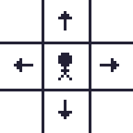
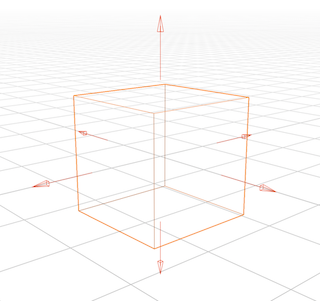
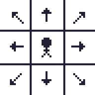

# Neighborhoods

### CardinalNeighborhood

Allows movement in the four cardinal directions on a 2D plane: **North, East, South, and West**.

### CardinalNeighborhood3d

Allows movement in all six cardinal directions in 3D space: **North, East, South, West, Up, and Down**.
This 3D neighborhood is also well-suited for 2D tilemap games with height layers, such as isometric maps.

### OrdinalNeighborhood

Extends cardinal movement by allowing diagonal movement in addition to the standard directions.

### OrdinalNeighborhood3d

Extends `CardinalNeighborhood3d` by allowing diagonal movement in all three dimensions—e.g., North-East-Up—for a total of 26 possible directions.

Like `CardinalNeighborhood3d`, this is also useful for 2D tilemap games with height layers, such as isometric maps.

A `NeighborFilter` is available to restrict diagonal movement to only within the same depth level, reducing the number of directions from 26 to 14. See [Filters](./02_filters.md) for more details.

## Implementing the Neighborhood Trait
While you *can* implement your own Neighborhood, it is not currently recommended.

To support neighbor caching, each grid cell stores its neighbors in a u32 bitmask, which limits the system to 26 directions. The provided built-in neighborhoods already cover all of these directions.

Switching to a per-cell `Vec` or `HashMap` of neighbors would drastically increase memory usage—potentially several gigabytes on large maps (e.g., 1024×1024x4 grids).

Before implementing a custom Neighborhood, check whether a built-in [Filter](./02_filters.md) already provides the neighbor generation behavior you need, or consult the documentation for creating a custom filter.