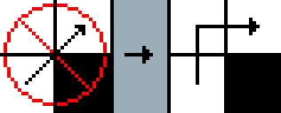
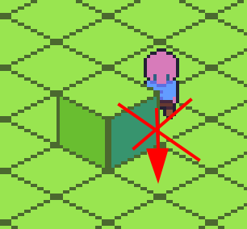
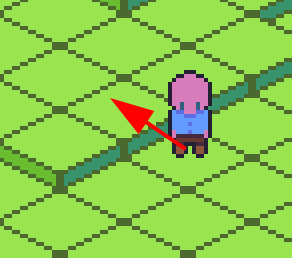

# Filters

`NeighborFilter`s can be applied during the stage when neighbors are calculated and cached. There are a few built-in ones but you can also implement the `NeighborFilter` trait yourself to create new ones.

Filters can be chained and they will be applied in the order that they are added to `GridSettingsBuilder`.

```rust,no_run
let grid_settings = GridSettingsBuilder::new_3d(64, 64, 4)
    .chunk_size(4)
    .add_neighbor_filter(filter::NoCornerClipping)
    .add_neighbor_filter(filter::DisallowZDiagonalMovement)
    .build();
```

## NoCornerCutting

Forces cardinal movement around impassable (wall) cells by preventing diagonal movement around ANY adjacent impassable (wall) cell.
Don't use with `NoCornerClipping` as this filter already covers clipping through corners.

Apply to `GridSettingsBuilder` with `.add_neighbor_filter(filter::NoCornerCutting)`.



## NoCornerCuttingFlat

Works the same as `NoCornerCutting` with the exception that paths can jump z depth diagonally around corners. *This is an ideal filter to use in 2.5D games*. You may want to disable agents from cutting diagonally around corners so your sprites don't clip through wall corners causing y sorting glitches, but retain the ability for your agents to jump to higher heights.




## NoCornerClipping

Prevents diagonal movement from clipping through impassable (wall) corners.
Don't use with `NoCornerCutting` as `NoCornerCutting` already handles this case.

Apply to `GridSettingsBuilder` with `.add_neighbor_filter(filter::NoCornerClipping)`.


## DisallowZDiagonalMovement

The `OrdinalNeighborhood3d` neighborhood allows diagonal movement along the Z axis.
If this isn't desired you can apply the `DisallowZDiagonalMovement` filter and it will limit diagonal movement to only cells on the same depth while still allowing Up and Down movement. 

# Implementing Your Own Filter

TODO, for now please see `filters.rs` in the source.


